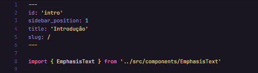
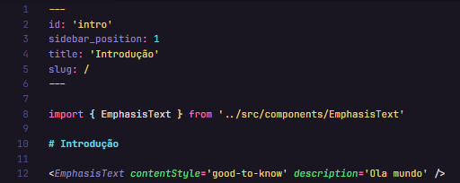
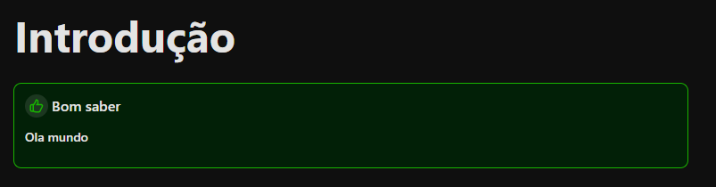

import { EmphasisText } from "../src/components/EmphasisText"

# Componentes com React

Durante a construção de uma documentação, podemos enfrentar momentos onde iremos repetir alguns trechos de conteúdo ou
estilização de algo, o que pode ser um pouco chato por ter que criar o mesmo trecho de código/ texto diversas vezes.

Pensando nisso que o Docussauros permite que escrevamos nossos próprios componentes e utilizá-los, inclusive,
em arquivos Markdown. Com isto, escrevemos apenas uma vez este trecho de código repetitivo e repassamos sua tag em
qualquer lugar que quisermos.

<EmphasisText 
  contentStyle="warning" 
  description="
    Atente-se que para componentes React funcionarem em arquivos Markdown é necessário que o arquivo esteja com a
    extensão em .mdx, caso não esteja o arquivo não irá entender código Javascript e retornará erros na página.
  " 
/>

## Escrevendo Componentes em React

Aqui não muda muita coisa em relação a criação normal de componentes usando React em sua forma mais pura, ou seja, a
melhor maneira de escrever componentes em React é pela [documentação oficial](https://react.dev/learn/typescript#typescript-with-react-components).

Lembrando que estamos usando Typescript, então a forma de escrever componentes muda um pouquinho.

Para mantermos o projeto organizado, iremos colocar os arquivos de componentes dentro de `src/components/`, cada
componente terá sua pasta, que leva o nome do componente (com as iniciais em letras maiúsculas), com um arquivo 
`index.tsx`.

Neste arquivo `index.tsx` você irá criar seu desejado componente.

Estamos utilizando [TailwindCSS](https://tailwindcss.com/) como framework de estilização, pela sua facilidade e
produtividade. Recomendo seu uso para mantermos um padrão de desenvolvimento.

Finalizado o componente, você agora irá importar este arquivo onde desejar. Nesta documentação irei abordar apenas como
importar componentes em arquivos `.mdx`, pois sua importação em diferentes extensões já é conhecida. Caso tenha alguma
dúvida visite a [documentação oficial](https://react.dev/learn/your-first-component).

## Importando Componentes em Arquivos Markdown

Com seu arquivo Markdown com a extensão `.mdx`, realize a importação padrão do componente abaixo das keywords de
configuração dos arquivos Markdown.

Após importado, só usá-lo da forma convencional, abrindo sua tag e setando, caso exista, as propriedades do componente.

Neste caso, estamos usando o componente de nome _EmphasisText_, que possui três propriedades:

- `contentStyle`: Define o tipo de estilização do contéudo. Existem três tipos: _tool-tip_, _good-to-know_ e _warning_;
- `description`: Descrição do contéudo;
- `key`: Propriedade opcional, define uma chave única para cada componente de mesmo nome. Interessante colocá-lo quando
tiver mais de um componente de mesmo nome no mesmo arquivo.

Este componente foi criado no intuito de definir, de forma enfática, alguns pontos que podem ser interessantes de serem
mostrados. Como dicas, curiosidades e avisos.

A importação do componente acima resulta no seguinte:

## Conclusão

Basicamente, é isto, não há muito segredo em relação a construção padrão de componentes React, apenas uma atenção na
hora de fazer sua importação.

Sempre que houver algum trecho de código/ texto que se repita muito (mais de duas vezes), é interessante e considerado
boa prática realizar sua refatoração e transformá-lo em um componente reutilizável.

<EmphasisText 
  contentStyle="warning" 
  description="
    No Docussauros não é permitido a criação de um componente dentro de outro componente, prática que é muito comum
    no mundo React.
  " 
/>