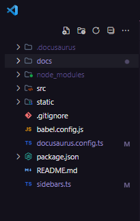
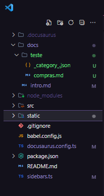

# Introdução

Aqui será onde iremos documentar todo o nosso processo de construção de software, tanto o front-end, as documentações e 
os prováveis requisitos funcionais e não funcionais.

## Como documentar pelo Docusaurus

Aqui será mostrado passo a passo como podemos realizar todo o processo de documentação com o Docusaurus.

Nesta sessão, irei abordar os principais pontos para realizar uma boa documentação. No entanto, a biblioteca é bem vasta e praticamente tudo pode ser alterado/modificado. Caso possua qualquer dúvida que não esteja abordada nesta documentação, recomendo fortemente que veja a documentação oficial do [Docusaurus](https://docusaurus.io/docs).

Antes de qualquer coisa, é bom documentarmos o máximo utilizando Markdown. Caso não saiba como escrever texto com ele, segue um bom guia: [Aprenda Markdown](https://blog.da2k.com.br/2015/02/08/aprenda-markdown/).

Partindo do pressuposto de que você esteja na branch correta e atualizou seu repositório local com as alterações da branch com `git pull`, vamos começar!

Você deve encontrar uma organização de pastas similar a esta:



Há três maneiras de criarmos conteúdo para a documentação: com "docs", com "pages" e com "blog". Basicamente, as "pages" são páginas distintas de conteúdo, podemos criar uma página de "sobre", por exemplo, mas não será necessário.

As "docs" são, justamente, os conteúdos de documentação, como esta página. Ao criar uma nova "doc", o Docusaurus irá criar automaticamente um slug no sidebar referente à "doc" criada. Como esta "doc" é intitulada de "Introdução", o sidebar na esquerda a referencia de tal forma.

Os "blogs" são parecidos com as "docs", mas com estilização e funcionalidades voltadas para construção de blogs, também não será necessário.

## Criando uma doc

Chega de papo. Como crio uma doc?

Crie um arquivo `.md` na pasta "docs" com um nome descritivo.

No arquivo criado, podemos utilizar algumas configurações referentes a ele em seu topo, como estas:

```
---
id: 'intro'
sidebar_position: 1
title: 'Introdução'
slug: /
---
```
- `id`: Opcional, serve para identificar o arquivo. É recomendado utilizá-lo, por mais que não precise colocá-lo,
  pois o Docusaurus define o id com o próprio nome do arquivo;
- `sidebar_position`: Este é obrigatório utilizarmos, para referenciar qual a posição da doc na sidebar. Atente-se para
  não deixar com o mesmo número de outro arquivo doc;
- `title`: Este é opcional, ele define o título do doc tanto na sidebar quanto no histórico de páginas. Caso não coloque,
  o Docusaurus irá definir o título como o H1 (heading 1 do arquivo);
- `slug`: Obrigatório, serve para definir o slug que é redirecionado na URL. 

Há vários tipos de parâmetros de configuração, mas acredito que estes serão os mais utilizados. Caso queira descobrir mais, veja
a documentação oficial do [Docusaurus](https://docusaurus.io/docs).

Após definir as tags de configuração no topo, agora é só popular o arquivo com os textos em Markdown.

Por padrão, no início de cada arquivo, vamos colocar o Heading 1 com o título igual ou similar ao que foi definido na
tag acima e no nome do arquivo. Como o exemplo que está na página, arquivo `intro.md`, o `title` das configurações é "Introdução",
e o Heading 1 também sendo "Introdução".

## Nesting de docs

É possível criar um nesting de docs e sidebar. Para fazer isso, basta criar uma pasta dentro de "docs" e colocar seu arquivo `.md` nela.

```
/docs > teste > compras.md
```

Feito isso, você já terá o nesting funcionando, mas talvez não do jeito que você quer. Pode haver algumas inconsistências.

Como percebeu, no sidebar ele ficará com o nome da pasta como referência, neste caso, _teste_. Para mudar este nome e algumas
outras coisas, é necessário criar um arquivo de configuração à parte. Dentro da pasta, crie um arquivo `_category_.json`, nele
estarão contidas as configurações desejadas.

Segue um exemplo abaixo:

```
{
  "label": "Agrupador",
  "position": 3,
  "link": {
    "type": "generated-index",
    "description": "Arquivos abaixo"
  }
}
```
- `label`: Define o título que irá aparecer na sidebar e histórico de páginas, neste caso, será trocado de _teste_ para _Agrupador_;
- `position`: Igual à configuração de docs, define a posição na sidebar;
- `link`: Objeto que possui outros parâmetros de configuração, _type_ e _description_ neste caso;
- `link/type`: Define o tipo de link. Caso não tenha o _Agrupador_, não será considerado como um doc. Neste caso, está sendo usado
  o `generated-index`, que irá gerar uma estilização especial para os docs que estiverem dentro desta pasta;
- `link/description`: Define uma descrição para a doc.

No fim, seus arquivos irão se parecer assim:



## Conclusão

Basicamente, é isso! Agrupei os principais pontos para a criação de docs nesta seção. Novamente, caso tenha alguma dúvida, utilize a documentação oficial para sanar tudo isso. [Documentação do Docusaurus](https://docusaurus.io/docs).